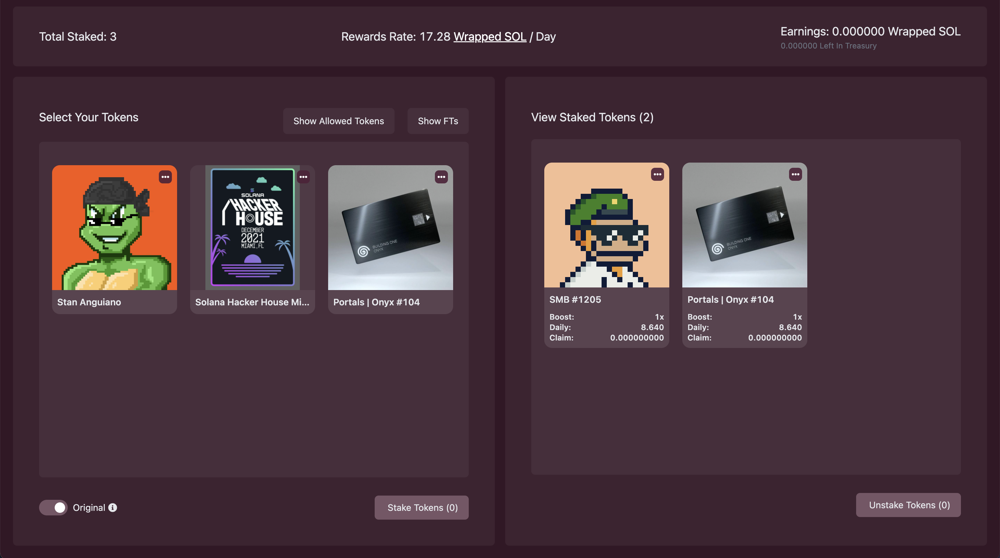

# Cardinal Staking UI

This repository hosts the UI inteface that powers **https://stake.cardinal.so** for staking NFTs on Solana.

Use this repo to create and deploy stake pools with built-in reward distribution, or build your own custom interface with our underlying staking protocol.

For questions or technical help, join our **[Discord](https://discord.gg/stX2FAYbVq)**.

---

<div style="text-align: center; width: 100%;">
  
</div>

## Create a Stake Pool

To create a stake pool, navigate to the admin page located at https://stake.cardinal.so/admin. This page hosts a form to create a stake pool with various configurations.

**Note:** All configurations in the admin page are optional. Also, filters in the stake pool configuration are **union-based**, if any one of the conditions is met, then the NFT will be allowed to stake in the pool.

After creating your stake pool, you will receive a **`Stake Pool Id`**. View your stake pool at https://stake.cardinal.so/[stakePoolId]

Pools by default will have no metadata. View the section titled "Customizing your Stake Pool" to learn about adding images, colors and custom pool name.

**Pool Creation Parameters:**

```typescript
export type StakePoolParams {
    requiresCollections?: PublicKey[];
    requiresCreators?: PublicKey[];
    requiresAuthorization?: boolean;
    overlayText?: string;
    imageUri?: string;
    resetOnStake?: boolean;
  }
```

**Reward Distribution Parameters**

```typescript
export type RewardDistributionParams {
    stakePoolId: PublicKey;
    rewardMintId: PublicKey;
    rewardAmount?: BN;
    rewardDurationSeconds?: BN;
    kind?: RewardDistributorKind;
    maxSupply?: BN;
    supply?: BN;
  }
```

There are two types of reward distribution (RewardDistributionKind) with Cardinal Staking.

1. **Mint** - give mint authority of your reward token to the stake pool so the pool can mint on demand
2. **Treasury** - transfer reward tokens from your wallet to the stake pool, top-up the stake pool treasury balance whenever needed.

## Environments

The program and related UIs are deployed on Solana mainnet-beta and devnet. By default the UI will point to mainnet. You can ovverride this by using `?cluster=devnet` in the URL or navigating to https://dev-stake.cardinal.so. All configuration is scoped to that environment, and no data including pools, reward distributors, tokens, NFTs or sol will be carried over from mainnet to devnet and vice-versa.

## Customizing your Stake Pool

In order to easily access your stake pool, airdrop NFTs on devnet for your specific collection and get a stake.cardinal.so/[projectName] url, you'll need to create a Stake Pool metadata object. NOTE if you specified a verified creator in a devnet pool, airdropped NFTs will not be allowed into that pool because your creator will not be verified.

```typescript
export type StakePoolMetadata = {
  // Name of this stake pool used as an id. Should be in lower-case kebab-case since it is used in the URL as /{name}
  // https://www.theserverside.com/blog/Coffee-Talk-Java-News-Stories-and-Opinions/Why-you-should-make-kebab-case-a-URL-naming-convention-best-practice
  name: string
  // Display name to be displayed in the header. Often the same as name but with capital letters and spaces
  displayName: string
  // Publickey for this stake pool
  stakePoolAddress: PublicKey
  // Default receipt type. Setting this will remove the option for the user to choose which receipt type to use
  receiptType?: ReceiptType
  // Default empty. Setting this will tell the UI to only show tokens of that standard. Supports fungible or non-fungible
  tokenStandard?: TokenStandard
  // Optional config to hide this pool from the main page
  hidden?: boolean
  // Optional config to disable finding this pool
  notFound?: boolean
  // Optional hostname to remap -- SEE NOTE BELOW
  hostname?: string
  // Optional config to link redirect to page when you click on this pool
  redirect?: string
  // Hide allowed tokens style
  hideAllowedTokens?: boolean
  // styles to apply to the whole stake pool
  styles?: CSSProperties
  // Colors object to style the stake page
  colors?: {
    primary: string
    secondary: string
    accent?: string
    fontColor?: string
    fontColorSecondary?: string
    backgroundSecondary?: string
  }
  // Disallow regions based on IP address
  disallowRegions?: { code: string; subdivision?: string }[]
  // Image url to be used as the icon in the pool selector and the header
  imageUrl?: string
  // Background banner image for pool
  backgroundBannerImageUrl?: string
  // Website url if specified will be navigated to when the image in the header is clicked
  websiteUrl?: string
  // Max staked is used to compute percentage of total staked
  maxStaked?: number
  // Links to show at the top right of the page
  links?: { text: string; value: string }[]
  // On devnet when you click the airdrop button on this page it will clone NFTs with this metadata and airdrop to the user. These will not contain verified creators
  airdrops?: AirdropMetadata[]
  // Analytics to show at the top of stake pool. supports trait based analytics and overall tokens data
  analytics?: Analytic[]
}
```

In `api/mapping.ts`, add your own object to the stakePoolMetadatas array. You'll now be able to access your project at http://localhost:3000/[name].

In order to get a custom Cardinal URL, **deploy your pool** on mainnet and then **make a PR** to our `api/mapping.ts` file in this repo with updates containing your pool's metadata.

## Stake Pool Fees

https://www.notion.so/cardinal-labs/Cardinal-Staking-Fees-14e66a64fb2d4615892937c5dbaa91cc

## Custom hostname

For a custom hostname...

1. Add your `hostname` to your pool config in `api/mapping.ts`
2. Open a PR to this repo with that change
3. Set the following record on your DNS provider to continue:

```
Type NAME CNAME
CNAME {your subdomain} cname.vercel-dns.com
```

## Deployment and Beyond

Now that you've made and deployed your Cardinal stake pool, you can either stick with Cardinal's UX for the stake pool experience or build your own.

Simply modify `pages/[stakePoolId]/index.tsx` with your own react styling, and host the stake pool on your own domain.

## Development

To get started, clone the repo and run:

```bash
yarn install
```

Next, run the development server:

```bash
yarn run dev
```

Open [http://localhost:3000](http://localhost:3000) with your browser to see the staking interface running locally.

## Set your Cluster

To access different clusters in the scaffold, set the `cluster` query parameter in the URL:

- Mainnet - http://localhost:3000?cluster=mainnet
- Devnet - http://localhost:3000?cluster=devnet
- Testnet - http://localhost:3000?cluster=testnet

The default cluster set is **mainnet**. It's recommended to ensure you have `?cluster=devnet` while testing out functionality.

## Have questions?

Join our **[Discord](https://discord.gg/cardinallabs)** to get technical support as you build on Cardinal.

---
